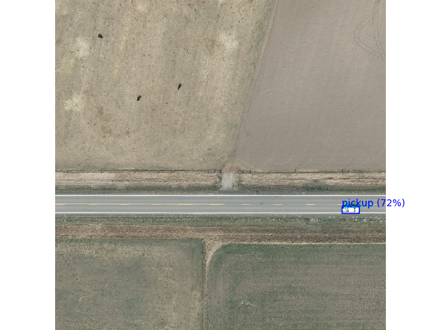
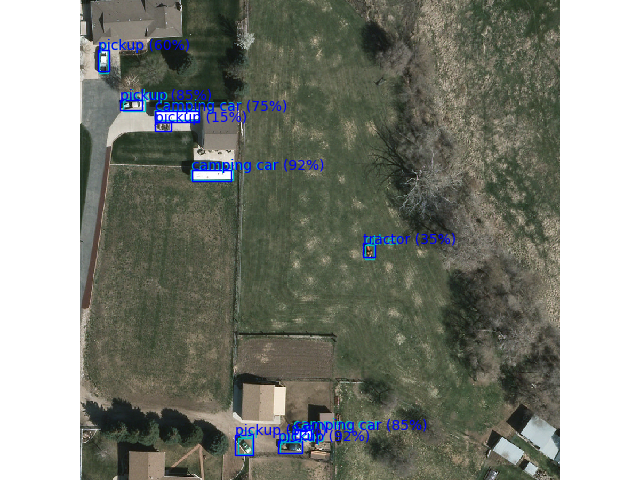
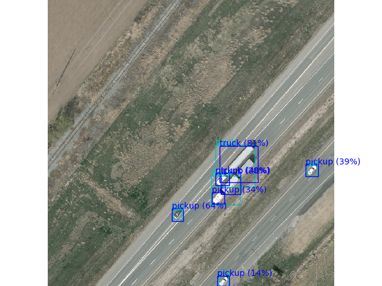

# pytorch-vedai

Using pyTorch for object detection on the VEDAI dataset: [Vehicle Detection in Aerial Imagery](https://downloads.greyc.fr/vedai/).

## Methodology
The challenge of this task is the small size of the dataset ie about 1250 labeled images.
To address this, we combined 3 strategies:

### Transfer learning
Instead of training a detector from scratch is use a pretrained detector and train only a few layers on the data.
We use the [Faster-RCNN](https://arxiv.org/abs/1506.01497) detector as it gives a good [tradeoff between speed and accuracy](https://arxiv.org/abs/1611.10012).
The detector is pretrained on the COCO dataset.
We modify the pre-trained model as little as possible and only reinitialize the two heads of the network
 * *the box predictor*: This is to reflect that our dataset only has 12 classes, requiring fewer parameters than the model trained on COCO.
 * *the head of the RPN*: We modify the anchor generator to focus on boxes that are half the size of the original (ie 16-256 pixels) and include wider aspect rations of 1:4 and 4:1. Empirically, this gave the best results.

Once the re-initialized heads are trained, we progressively activate the gradients for more layers. This is what the class [`GradientSchedule`](src/gradient_schedule.py) does.

### Data augmentation
To make the most of the few samples we have, we use extensive data-augmentation. The challenge is to apply the same transformation to the image and the box. For this we make use of open-CV.

The file [augmentation.py](src/data_manip/augmentation.py) defines the following transformations:

 * `RandomHSV`: Changes the brightness, contrast, saturation and hue of the image
 * `RandomAxisFlip`: Flips the image over the horizontal, vertical and diagonal axis of the image
 * `RandomRotate:` Rotates the image by an angle without loss of any part at the corners of the image
 * `RandomShear`: Shears the image horizontally
 * `RandomScale`: Zooms in or out of the image
 * `RandomTranslate`: Moves the image horizontally and vertically

We observe that without augmentation, validation-loss is about twice (0.17 vs 0.10) the training-loss after only 3000 training steps. The data-augmentation is therefore helpful in avoiding over-fitting despite the small dataset.
The pictures below, show 4 distinct variations of the same image.

### Data extension
Before training the network on the VEDAI dataset, we also train it on the DOTA: [Dataset for Object Detection in Aerial Images](https://captain-whu.github.io/DOTA/dataset.html).
The latter contains about 1700 images. The images have scale-per-pixel comparable to VEDAI but are much larger. We therefore randomly crop sub-parts of the same size as the images in VEDAI (1012x1024) at training time, making the effective size of the dataset much larger.
We only train the image on classes with size comparable to those in VEDAI (eg vehicles, storage tanks, planes) and ignore larger objects (eg Bridges, basketball courts).

The graph shows the convergence of the model on VEDAI, with and without pre-training on DOTA.

## Other remarks

#### Learning rate
Since we have very few data samples and have a pre-trained model, we want to make adjustment very slowly. Therefore, and also because of the small batch size, we use an unusually low learning rate of `5e-5`. We decay this learning rate by a factor `0.3` twice during training.

#### Bounding-Boxes in VEDAI
The bounding boxes in VEDAI (and by selection, DOTA as well) are very small and some have extreme aspect rations.
Our model is pre-traiend and designed on COCO for which this is less the case.
To adapt to this particularity, we adjust the Anchor generator of our model to propose boxes that are half as small and also boxes with aspect ratios `4:1` and `1:4` (as already mentioned above). We determined these setting empirically.

#### Non-maximum suppression
Its is difficult (for the model) to distinguish between the classes and the model frequently predicts a car and en a pickup truck in roughly the same location.
To counteract this, we add non-maximum suppression with IOU threshold 90%. The Faster-RCNN already has NMS but applied it on a per class level. Ours is applied irrespectively of the class.

## Speed considerations

Training on my CPU is very slow. This is also because python/pyTorch can only use one core.
To train on multiple cores, we implement synchronized SGD using pyTorch's `DistributedDataParallel`.
We use batch size 1 on 6 processes resulting in a 3x acceleration (there is a bottleneck due to gradient synchronization between processes at every step).

## Detection performance

The pictures below show a few detections on validation images.

Pre-training our model on DOTA and then on VEDAI, we get the performance graphs below.

As one can see from the loss, we do not suffer any over-fitting.

For evaluation, we use the definition of the mean-average-precision from the VOC Pascal challenge (interpolated version).
For speed reasons, the mAP is sampled every 25 training steps over one batch of the validation set. This means that we compute mAP on a per image basis and the average over images.

The graph below shows the evolution of the mAP calculated as such during training. The final value of the mAP is 57.0%.

On the right axis, we show the number of parameter currently under training ie with gradients activated.

Yet, mAP should correctly be computed over the whole validation set. This is what the script [run_eval.py](src/entrypoints/run_eval.py) does. Our actual mAP is closer to 54.6%. We believe that this result could be improved further without my hardware limitations ie no GPU available. In fact, we believe that training longer on both DOTA and VEDAI, on the full image size (1024 instead of 900) (and potentially reducing the size of the validation set on DOTA) would further improve detection performance.
