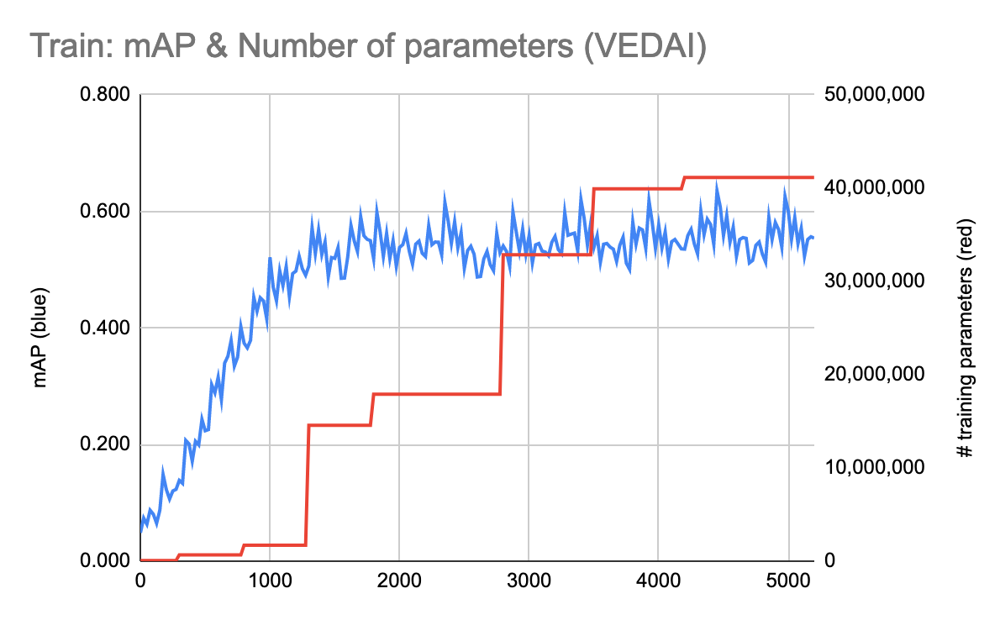
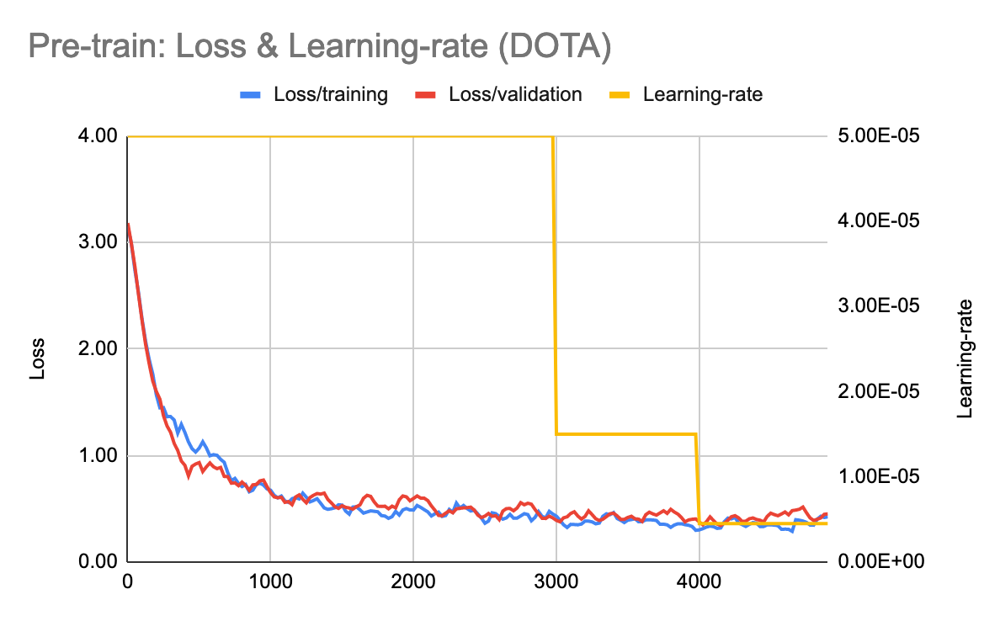

# pytorch-vedai

| **Work In Progress** |
| --- |

Using pyTorch for object detection on the VEDAI dataset: [Vehicle Detection in Aerial Imagery](https://downloads.greyc.fr/vedai/).

## Methodology
The challenge of this task is the small size of the dataset ie about 1250 labeled images.
To address this, we combined 3 strategies:

### Transfer learning
Instead of training a detector from scratch is use a pretrained detector and train only a few layers on the data.
We use the [Faster-RCNN](https://arxiv.org/abs/1506.01497) detector as it gives a good [tradeoff between speed and accuracy](https://arxiv.org/abs/1611.10012).
The detector is pretrained on the COCO dataset.
We modify the pre-trained model as little as possible and only reinitialize the two heads of the network
 * *the box predictor*: This is to reflect that our dataset only has 12 classes, requiring fewer parameters than the model trained on COCO.
 * *the head of the RPN*: We modify the anchor generator to focus on boxes that are half the size of the original (ie 16-256 pixels) and include wider aspect rations of 1:4 and 4:1. Empirically, this gave the best results.

Once the re-initialized heads are trained, we progressively activate the gradients for more layers. This is what the class [`GradientSchedule`](src/gradient_schedule.py) does.

### Data augmentation
To make the most of the few samples we have, we use extensive data-augmentation. The challenge is to apply the same transformation to the image and the box. For this we make use of open-CV.

The file [augmentation.py](src/data_manip/augmentation.py) defines the following transformations:
 
 * `RandomHSV`: Changes the brightness, contrast, saturation and hue of the image
 * `RandomAxisFlip`: Flips the image over the horizontal, vertical and diagonal axis of the image
 * `RandomRotate:` Rotates the image by an angle without loss of any part at the corners of the image
 * `RandomShear`: Shears the image horizontally
 * `RandomScale`: Zooms in or out of the image
 * `RandomTranslate`: Moves the image horizontally and vertically

We observe that without augmentation, validation-loss is about twice (0.17 vs 0.10) the training-loss after only 3000 training steps.
The pictures below, show 4 distinct variations of the same image.

### Data extension
Before training the network on the VEDAI dataset, we also train it on the DOTA: [Dataset for Object Detection in Aerial Images](https://captain-whu.github.io/DOTA/dataset.html). 
The latter contains about 1700 images. The images have scale-per-pixel comparable to VEDAI but are much larger. We therefore randomly crop sub-parts of the same size as the images in VEDAI (1012x1024) at training time, making the effective size of the dataset much larger. 
We only train the image on classes with size comparable to those in VEDAI (eg vehicles, storage tanks, planes) and ignore larger objects (eg Bridges, basketball courts).

The graph shows the convergence of the model on VEDAI, with and without pre-training on DOTA.

## Performance

Pre-training our model on DOTA and then on VEDAI, we get the performance graphs below.
The mean-average-precision is sampled over a batch of the validation set.
On the right axis, we show the number of parameter currently under training ie with gradient activated.

As one can see from the loss, we do not suffer any over-fitting.

## Speed considerations
Training on my CPU is very slow. This is also because python/pyTorch can only use one core.
To train on multiple cores, we implement synchronized SGD using pyTorch's `DistributedDataParallel`.

